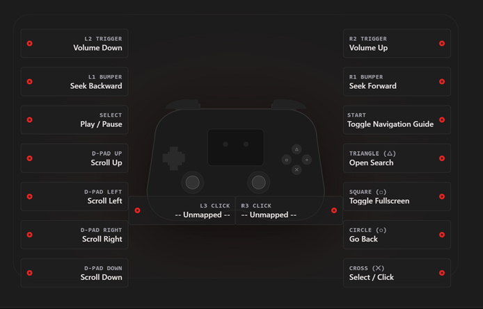
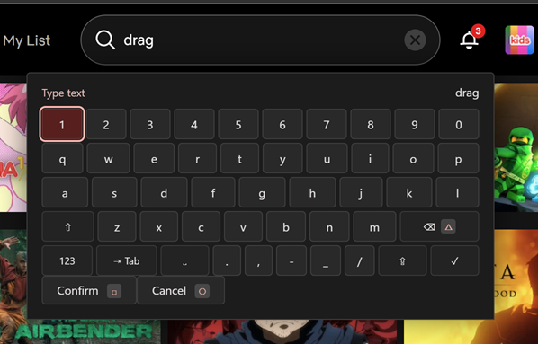
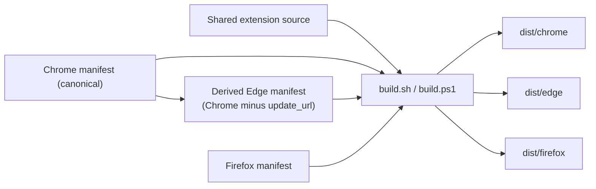
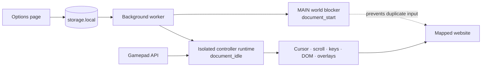

<p align="center">
  
</p>

<h1 align="center">Remapad</h1>

<p align="center">
  <strong>Turn a standard gamepad into a complete browser controller.</strong>
</p>

<p align="center">
  Navigate streaming interfaces, control playback, move a virtual cursor, and
  type with an on-screen keyboard—without reaching for a mouse or keyboard.
</p>

<p align="center">
  
  
  
  
  
</p>

---

Remapad is a cross-browser Manifest V3 extension for USB and Bluetooth
controllers. It combines site-specific button mappings with gamepad-first
navigation tools, giving developers a practical foundation for controller-driven
web experiences on Firefox and Chromium-based browsers.

- Firefox Add-ons: <https://addons.mozilla.org/en-US/firefox/addon/remapad/>
- Chrome Web Store: <https://chromewebstore.google.com/detail/remapad-%E2%80%94-gamepad-browser/nbjngbeilcghlhgcofapgclljddnlaol>
- Microsoft Edge Add-ons: <https://microsoftedge.microsoft.com/addons/detail/remapad-%E2%80%94-gamepad-browser/ihhkjgcalmhooihpdcdifapgladiblgj>

### Source repositories

| Repository | Role |
| --- | --- |
| [GitLab](https://gitlab.com/Shin-Aska/remapad) | Primary development repository |
| [GitHub](https://github.com/Shin-Aska/remapad) | Mirror |

## See it in action

### Map browser actions visually

Select a controller button and bind it to playback, navigation, keyboard, or
direct DOM actions.



### Type from the couch



## What makes Remapad useful

- **Site-specific profiles** — customize Netflix, Prime Video, or any domain
  while retaining a shared fallback profile.
- **Visual mapping editor** — see connected controller input and edit bindings
  from a controller-shaped interface.
- **Configurable stick navigation** — assign either stick to a virtual cursor,
  scrolling, directional navigation, or no action.
- **Direct DOM actions** — click, focus, scroll to, fill, toggle, or control a
  selected page element without depending on keyboard shortcuts.
- **Keyboard capture** — bind physical keys and modifier combinations such as
  `Ctrl+Alt+S`.
- **On-screen keyboard** — enter text using a gamepad on pages designed around
  physical keyboard input.
- **Navigation HUD and tutorial** — expose the active bindings without leaving
  the current page.
- **Controller glyphs** — automatically select PlayStation, Xbox, or Nintendo
  button labels, with a manual override.
- **Page-level gamepad isolation** — prevent an enabled site from handling the
  same controller input and causing duplicate actions.

## Developer quick start

Remapad uses plain HTML, CSS, and JavaScript. There is no package-manager install
and no bundler.

### Requirements

- Git
- Firefox 140+, Chrome 111+, and/or current desktop Microsoft Edge for manual
  testing
- Bash with Python 3, **or** PowerShell
- A standard USB or Bluetooth gamepad for input testing

Clone your fork or the upstream repository:

```bash
git clone https://gitlab.com/ShinAska/remapad.git
cd remapad
```

Build all three browser variants with Bash:

```bash
bash scripts/build.sh
```

Or run the native PowerShell build from PowerShell:

```powershell
.\scripts\build.ps1
```

Build one target while iterating:

```bash
bash scripts/build.sh chrome
bash scripts/build.sh edge
bash scripts/build.sh firefox
```

```powershell
.\scripts\build.ps1 chrome
.\scripts\build.ps1 edge
.\scripts\build.ps1 firefox
```

Both builders accept `all` (the default), `chrome`, `edge`, or `firefox`. They
validate both canonical manifests and create:

| Target | Unpacked extension | Store package |
| --- | --- | --- |
| Chrome | `dist/chrome/` | `dist/remapad-chrome-<version>.zip` |
| Edge | `dist/edge/` | `dist/remapad-edge-<version>.zip` |
| Firefox | `dist/firefox/` | `dist/remapad-firefox-<version>.zip` |

### Load the unpacked extension

#### Chrome

1. Open `chrome://extensions/`.
2. Enable **Developer mode**.
3. Select **Load unpacked**.
4. Choose `dist/chrome/`.

#### Edge

1. Open `edge://extensions/`.
2. Enable **Developer mode**.
3. Select **Load unpacked**.
4. Choose `dist/edge/`.

Reload the Edge extension from `edge://extensions/` after rebuilding. Edge is a
separate installation with its own local extension settings; this project does
not transfer Chrome settings to Edge automatically. Test and record the exact
current stable desktop Edge version used. This guidance does not make a compatibility
claim for older or mobile Edge releases.

#### Firefox

1. Open `about:debugging#/runtime/this-firefox`.
2. Select **Load Temporary Add-on…**.
3. Choose `dist/firefox/manifest.json`.

After rebuilding, reload the extension from the browser’s extension debugging
page before testing again.

## Architecture

### Build



### Runtime



## Repository map

| Path | What lives there |
| --- | --- |
| `background/` | Dynamic script registration and extension messaging |
| `content/` | Gamepad polling, page actions, overlays, cursor, and navigation |
| `options/` | Settings, mapping editor, tutorials, and input preview |
| `popup/` | Toolbar popup |
| `shared/` | Code reused by multiple extension surfaces |
| `manifests/` | Browser-specific Manifest V3 files |
| `scripts/` | Bash and PowerShell builds |
| `_locales/` | Localized extension strings |
| `assets/`, `icons/` | Runtime assets and extension icons |
| `docs/assets/` | README screenshots |
| `dist/` | Generated unpacked builds and ZIP packages |

> Options and content modules are classic scripts loaded in a defined order;
> their entry points own the runtime state.

## Cross-browser strategy

Chrome, Edge, and Firefox share all extension logic and assets. Chrome and
Firefox retain the two canonical manifests. The build derives Edge from the
Chrome manifest and omits only its top-level `update_url` in the generated Edge
copy; there is no separately maintained Edge manifest.

| Concern | Chrome | Edge | Firefox |
| --- | --- | --- | --- |
| Manifest source | `manifest.chrome.json` | Generated from Chrome | `manifest.firefox.json` |
| Background entry | `service_worker` | `service_worker` | `scripts` |
| Browser metadata | `minimum_chrome_version` | Chrome metadata except `update_url` | `browser_specific_settings.gecko` |
| Source code | Shared | Shared | Shared |
| Build output | `dist/chrome/` | `dist/edge/` | `dist/firefox/` |

When changing shared manifest metadata—especially the name, description, or
version—update both canonical files under `manifests/`. The build fails when
required shared fields drift, then generates the matching Edge metadata.

## Working on Remapad

A productive development loop is:

1. Make a focused source change.
2. Run the build for the affected browser.
3. Reload the unpacked extension.
4. Open the options page and confirm controller input.
5. Test the affected mapping on a real site.
6. Run the full three-browser build before submitting.

There is currently no automated test suite, so compatibility reports should
include the browser and version, operating system, controller model and
connection type, and tested websites.

See [CONTRIBUTING.md](CONTRIBUTING.md) for the complete validation checklist and
merge-request guidance.

Preparing a store release? Use the
[three-browser release checklist](docs/release-checklist.md) and the
[store listing notes](docs/store-listing.md).

## Permissions and privacy

Remapad stores configuration in the browser’s local extension storage. Netflix
and Prime Video are built-in profiles; access to any other site is requested
only when the user adds that domain.

Remapad has no analytics, advertising, telemetry, or remote code. See the
[privacy policy](PRIVACY.md) for the complete data-handling statement.

If you contribute a new permission or network dependency, document why it is
required and keep its scope as narrow as possible.

## License

Remapad is distributed under the
[GNU General Public License version 3](LICENSE), identified by the SPDX
expression `GPL-3.0-only`.
