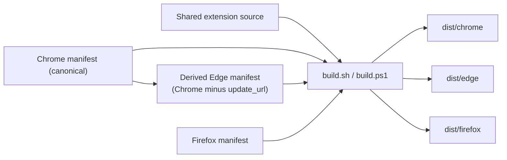
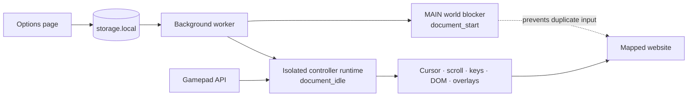

# Architecture

## Build pipeline

The build takes shared source plus two canonical manifests (Chrome and Firefox)
and produces three browser-specific outputs. Edge is derived from Chrome with
only `update_url` removed.

## Runtime

## Repo layout

| Path | Description |
| --- | --- |
| `background/` | Script registration and extension messaging |
| `content/` | Gamepad polling, actions, overlays, cursor, nav |
| `options/` | Settings, mapping editor, tutorials, input preview |
| `popup/` | Toolbar popup |
| `shared/` | Code shared across extension surfaces |
| `manifests/` | Browser-specific Manifest V3 files |
| `scripts/` | Bash and PowerShell builds |
| `_locales/` | Localized strings |
| `assets/`, `icons/` | Runtime assets and extension icons |
| `docs/assets/` | README screenshots |
| `dist/` | Generated builds and ZIPs (not committed) |

> Options and content modules are classic scripts loaded in order; their entry
> points own the runtime state.

## Cross-browser details

Chrome, Edge, and Firefox share all code and assets. Chrome and Firefox each
have a canonical manifest. The build derives Edge's manifest from Chrome's,
dropping only the `update_url` field. There's no separate Edge manifest to
maintain.

| | Chrome | Edge | Firefox |
| --- | --- | --- | --- |
| Manifest source | `manifest.chrome.json` | Generated from Chrome | `manifest.firefox.json` |
| Background entry | `service_worker` | `service_worker` | `scripts` |
| Browser metadata | `minimum_chrome_version` | Chrome metadata minus `update_url` | `browser_specific_settings.gecko` |
| Code | Shared | Shared | Shared |
| Build output | `dist/chrome/` | `dist/edge/` | `dist/firefox/` |

If you change shared manifest fields (name, description, version), update both
canonical files in `manifests/`. The build will fail if they drift.
